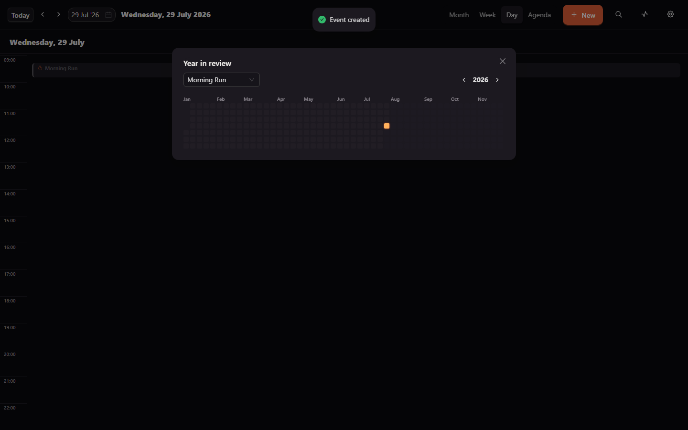
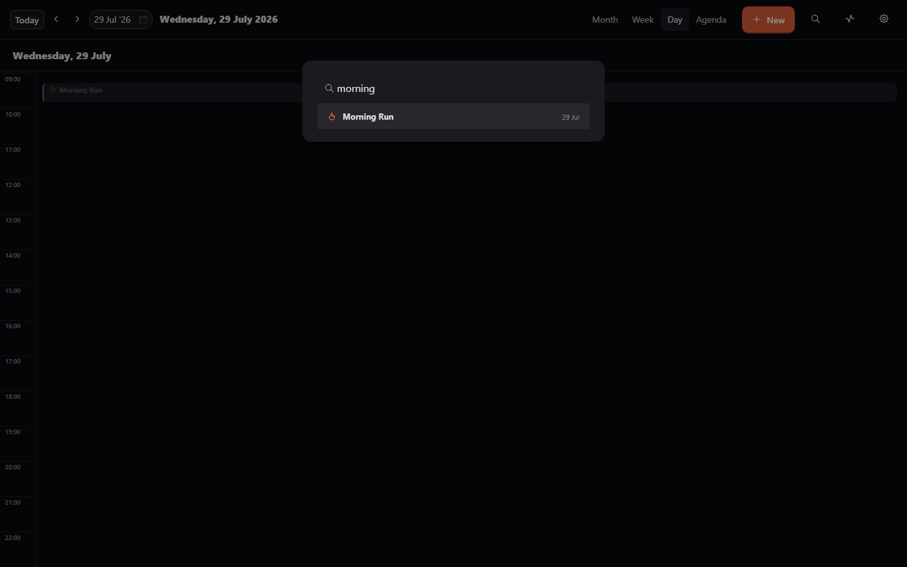
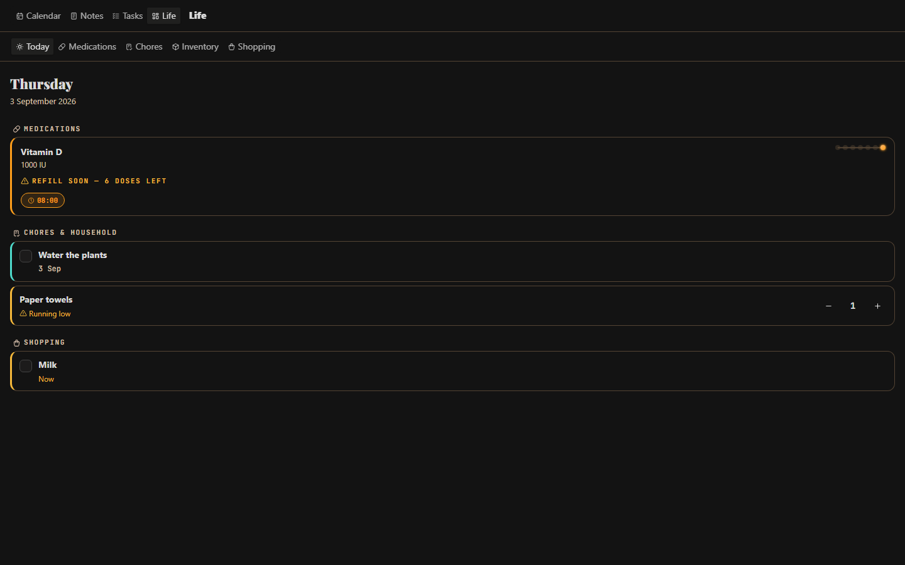
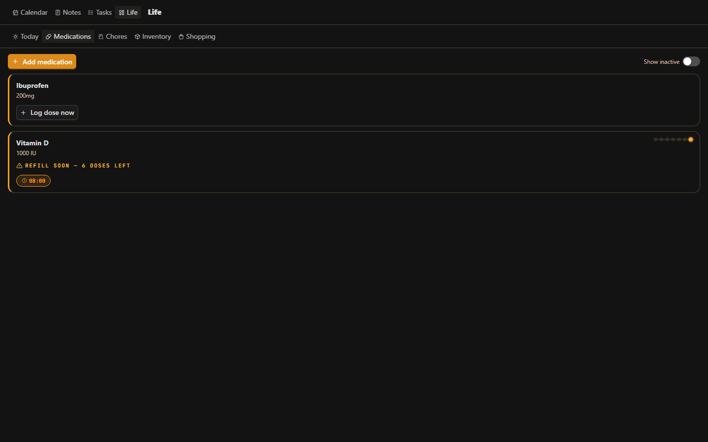
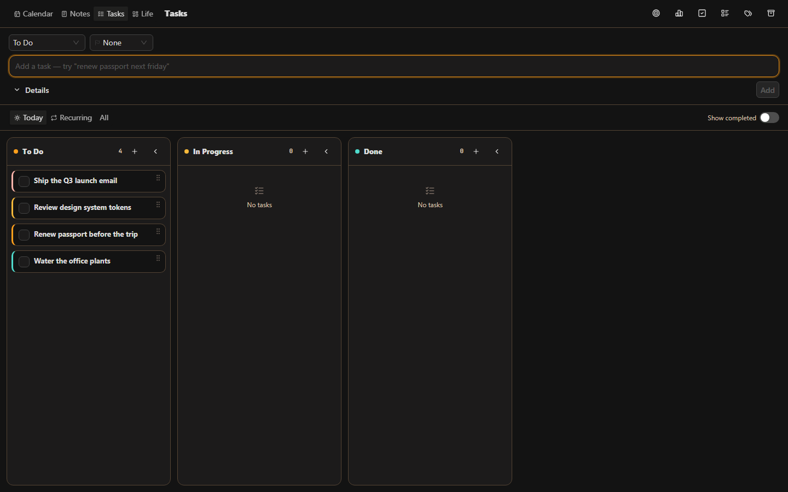
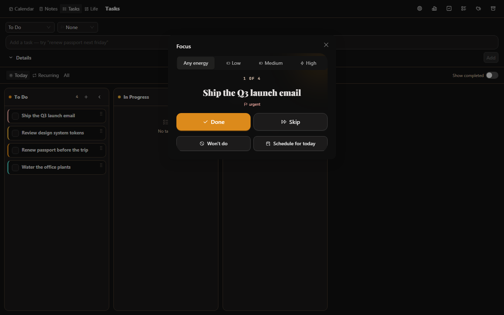

<div align="center">

# 🔥 Kiwami

### *Own your days.*

A local-first, four-tab life PWA — **Calendar · Notes · Tasks · Life** — that
fuses a full Month/Week/Day/Agenda calendar with a **routine/streak engine**,
rich-text notes, a full Kanban task board, and medication/chore/inventory/
shopping tracking. No account, no server, your data never leaves your device.

**🔗 Live: [kiwami-kappa.vercel.app](https://kiwami-kappa.vercel.app/)** —
installable as a PWA straight from the browser.


</div>

---

## ✨ Highlights

- 🔥 **Ember Chain** — the signature streak visual. Not a progress bar, not
  a ring: a horizontal chain of beads that glows amber when a routine's
  done, goes cold ash the day it's missed, and pulses softly on an
  unresolved today. A chain that can catch fire or go cold.
- 📅 **Full calendar surface** — Month, Week, Day, and Agenda views, all
  first-class. Drag-to-create, drag-to-move, and drag-to-resize on the
  time grid; a real "+N more" overflow in Month view.
- 🖥️ **Actually desktop-optimized, not a phone card** — full-width
  proportional grids that use a real monitor's screen, collapsing cleanly
  to a Day+Agenda mobile layout below the breakpoint. Built and verified on
  both a 1440px desktop viewport and a 390px phone viewport.
- 🍽️ **Food-time slots** — define Breakfast/Lunch/Dinner/snack times once;
  they show up as fixed recurring blocks with their own visual language
  (teal + fork/knife) and a one-tap Ate/Skipped log.
- 🧠 **A recurrence engine that's actually correct** — daily / weekly with a
  weekday picker / monthly with fixed-day clamping / custom every-N-days-
  or-weeks, anchored so the cadence never drifts depending on which window
  you're viewing. 18 unit tests covering the edge cases (month-end
  clamping, anchor boundaries, exclusion dates).
- 🌗 **Dark/light theming** that respects `prefers-color-scheme` by
  default and remembers an explicit override.
- 📴 **Genuinely offline-first** — installable PWA, verified end-to-end
  with the network fully disabled: service worker installed, app reloaded
  offline, still fully interactive.
- 🎬 **A real preloader**, not a spinner — a short cinematic intro with a
  bead-ring that lights up (a preview of the Ember Chain to come).
- 🔒 **100% local** — IndexedDB via Dexie is the source of truth. A Convex
  schema exists for future background sync, but nothing leaves your device
  today.
- 🗓️ **Ember Year Heatmap** — a GitHub-contributions-style grid for any
  routine's whole year, colored with the same ember/ash palette as the
  chain instead of green squares.
- ⌨️ **Command Palette (Ctrl/Cmd+K)** — fuzzy search across every event by
  title, jump straight to its date, or jump to Today, all keyboard-driven.
- 💎 **Forged streak milestones** — hit a 7/30/100/365-day streak and that
  day's bead forges into a faceted diamond with a one-time burst animation.
- 🩺 **Life tab** — medications (scheduled + as-needed, with the same Ember
  Chain adherence streak and a refill-countdown alert), chores (recurring,
  with an optional "reschedule from when you actually finish it" mode),
  household inventory with a running-low flag, and a wishlist → buy-list
  lifecycle with store grouping and offline share/clipboard export — all
  unified into a single cross-domain **Today Digest**.
- ✅ **A real Kanban task board** — drag-and-drop columns (`@dnd-kit`) with
  velocity-based card tilt while dragging, collapsible columns, bulk
  select → move/archive, priority color-coding, tags, subtasks with
  one-tap "Help me start" breakdown templates, and a glass "Focus" mode
  that surfaces one task full-screen with Done/Skip/Won't-do actions.
- 📝 **Apple-Notes-style rich text** — a full-screen `Tiptap` editor
  (headings, bold/italic/underline/strikethrough, text color,
  bulleted/numbered/checklist lists), autosaving on a debounce with no
  Save button, plus offline NLP date/time parsing (`chrono-node`) for
  quick Tasks/Reminders entry.

## 📸 Screenshots

<table>
<tr>
<td width="60%">

**Month view** — routines (flame, ember) and food slots (fork/knife, teal)
rendered with distinct visual language on the same grid.


</td>
<td width="40%">

**The Ember Chain** — streak number, full bead history, and explicit
Done/Missed actions (never a silent tap-to-cycle, so a mis-tap can't break
a streak).


</td>
</tr>
<tr>
<td>

**Agenda view** — chronological, grouped by day, with a compact Ember Chain
preview riding alongside each routine row.


</td>
<td>

**Mobile** — the view switcher collapses to Day + Agenda only; everything
else (sheets, forms, drag targets) is touch-sized by default.


</td>
</tr>
<tr>
<td>

**Ember Year Heatmap** — GitHub-contributions-style, per routine, colored
with the Ember Chain's own palette.



</td>
<td>

**Command Palette** — Ctrl/Cmd+K or the toolbar search icon, one search
surface either way.



</td>
</tr>
<tr>
<td>

**Life tab — Today Digest** — a cross-domain daily view: due medications,
chores due/overdue, running-low inventory, and urgent buy-list items, all
in one scroll.



</td>
<td>

**Life tab — Medications** — scheduled doses with their own compact Ember
Chain streak, a refill-countdown alert, and one-tap PRN logging.



</td>
</tr>
<tr>
<td>

**Tasks — Kanban board** — drag-and-drop columns, priority color-coded left
borders, collapsible columns, and bulk select for move/archive.



</td>
<td>

**Tasks — Focus mode** — the "Floating Blade" glass treatment surfaces one
task full-screen with Done/Skip/Won't-do/Schedule-for-today actions.



</td>
</tr>
</table>

## 📦 What's inside

| | View / feature | What it does |
|---|---|---|
| 🗓️ | **Month** | Grid with event pills, "+N more" overflow popover |
| 📆 | **Week** | 7-day time grid, drag-to-create/move, resize handle |
| 📋 | **Day** | Single-column time grid, more detail per event |
| 📃 | **Agenda** | Chronological list grouped by day, rolling 30-day window |
| 🔥 | **Routines** | Recurring blocks that must be marked Done/Missed per occurrence; cached streak count; auto-miss sweep breaks a streak if a past day is left unresolved |
| 🍽️ | **Food-time slots** | Named, retimeable recurring slots with a one-tap Ate/Skipped log — adherence only, no macro tracking |
| 🗓️ | **Year in review** | Per-routine GitHub-style heatmap, pick any routine and year |
| ⌨️ | **Command Palette** | Ctrl/Cmd+K or the toolbar search icon — search by title, jump to a date, jump to Today |
| 📝 | **Notes** | Full-screen rich-text editor (Tiptap) — headings, bold/italic/underline/strike, color, checklists — autosaves on a debounce, no Save button |
| ✅ | **Tasks** | Kanban board (`@dnd-kit`), lists/tags, priorities, subtasks + "Help me start" templates, bulk select, collapsible columns, glass Focus mode |
| 🩺 | **Life — Medications** | Scheduled (multi-dose/day, any recurrence) + as-needed, Ember Chain adherence streak, refill-countdown alert |
| 🧹 | **Life — Chores** | Recurring or one-off, fixed-schedule or reschedule-from-completion, no streak (completion-based, not habit-based) |
| 📦 | **Life — Inventory** | Quantity tracking with a running-low flag, one tap to add a low item straight to the buy list |
| 🛒 | **Life — Shopping** | Wishlist → promote → buy list → mark bought, grouped by store, offline share/clipboard export |
| ☀️ | **Life — Today Digest** | Every domain above, unified: due/overdue catch-up, now/next, schedule, tasks, chores, shopping — in one scroll |
| ⚙️ | **Settings** | Theme toggle (dark/light, respects system default), food-slot management |
| 🔑 | **Keyboard** | ←/→ step the period, `T` jumps to Today, Ctrl/Cmd+K opens search |

## 🛠 Tech stack

**React 19** · **TypeScript (strict)** · **Vite 5** · **Ant Design 5** ·
**Dexie (IndexedDB)** · **Framer Motion** · **@dnd-kit** (Tasks board) ·
**Tiptap** (rich-text Notes) · **react-icons (Tabler)** · **dayjs** ·
**chrono-node** (offline NLP dates) · **vite-plugin-pwa** · optional
**Convex** (schema ready, sync deferred) · **Vitest**

## 🚀 Quick start

```bash
npm install
npm run dev          # prints Local + Network URL — open the Network URL on your phone
```

```bash
npm run build         # -> /dist, generates the PWA service worker
npm run preview        # serve /dist to verify the installed/offline experience
npm run test            # vitest — recurrence, streak, medication/inventory logic, etc. (61 tests)
```

## ☁️ Deploying

Kiwami is a fully static PWA — no router, no backend (the Convex schema in
`convex/` isn't wired to any function yet), so there's genuinely nothing
server-side to configure:

```bash
npm run build   # -> dist/, a fully self-contained static site + service worker
```

Deploy the `dist/` folder to any static host — **Vercel, Netlify, Cloudflare
Pages, GitHub Pages, or a plain S3/CloudFront bucket all work with zero
extra config**, since there's no client-side routing that needs an
SPA-fallback rewrite rule. A couple of things worth knowing:

- `vite.config.ts` has no custom `base` (defaults to `/`) — correct for a
  custom domain or any host that serves from the root. Only a **GitHub
  Pages project site** (e.g. `you.github.io/kiwami`, not a custom domain)
  needs `base: "/kiwami/"` added before building.
- The install prompt, offline support, and app icons are all already wired
  (`vite-plugin-pwa`, `public/manifest.webmanifest`, `public/icons/*`) —
  nothing extra needed for "Add to Home Screen" to work once it's live on
  HTTPS (every host above provides that automatically).
- Run `npm run preview` after building to sanity-check the production
  build locally (with the real service worker, not the dev server) before
  pushing it anywhere.

## 🧱 Architecture

```
UI (features/*/*.tsx)        ← presentational only, never touches Dexie directly
  └─ data hooks (lib/*.ts)   ← the ONLY place Dexie is read/written
       └─ db (src/db/db.ts)  ← typed tables, export/import
```

## 🔒 Privacy

100% on-device. No analytics, no account, no network required to use any
feature. A Convex schema exists for optional future background sync, but no
sync functions are wired up — nothing is sent anywhere today.

## 📄 License

MIT

<div align="center"><sub>Built for a daily-use calendar that doesn't look like everyone else's · by Apurva</sub></div>
