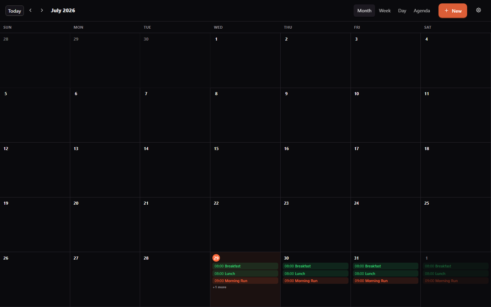
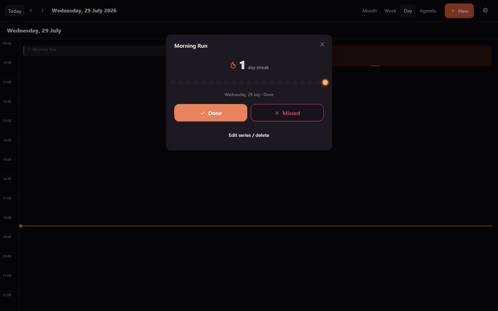
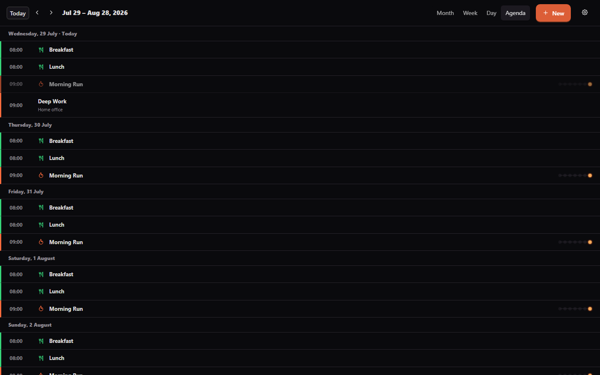
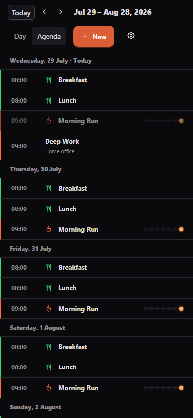

<div align="center">

# 🔥 Kiwami

### *Own your days.*

A local-first calendar PWA that fuses a full Month/Week/Day/Agenda view with
a **routine/streak engine** and **food-time adherence tracking** — no
account, no server, your data never leaves your device.


</div>

---

## ✨ Highlights

- 🔥 **Ember Chain** — the signature streak visual. Not a progress bar, not
  a ring: a horizontal chain of beads that glows amber when a routine's
  done, goes cold ash the day it's missed, and pulses softly on an
  unresolved today. A chain that can catch fire or go cold.
- 📅 **Full calendar surface** — Month, Week, Day, and Agenda views, all
  first-class. Drag-to-create, drag-to-move, and drag-to-resize on the
  time grid; a real "+N more" overflow in Month view.
- 🖥️ **Actually desktop-optimized, not a phone card** — full-width
  proportional grids that use a real monitor's screen, collapsing cleanly
  to a Day+Agenda mobile layout below the breakpoint. Built and verified on
  both a 1440px desktop viewport and a 390px phone viewport.
- 🍽️ **Food-time slots** — define Breakfast/Lunch/Dinner/snack times once;
  they show up as fixed recurring blocks with their own visual language
  (teal + fork/knife) and a one-tap Ate/Skipped log.
- 🧠 **A recurrence engine that's actually correct** — daily / weekly with a
  weekday picker / monthly with fixed-day clamping / custom every-N-days-
  or-weeks, anchored so the cadence never drifts depending on which window
  you're viewing. 18 unit tests covering the edge cases (month-end
  clamping, anchor boundaries, exclusion dates).
- 🌗 **Dark/light theming** that respects `prefers-color-scheme` by
  default and remembers an explicit override.
- 📴 **Genuinely offline-first** — installable PWA, verified end-to-end
  with the network fully disabled: service worker installed, app reloaded
  offline, still fully interactive.
- 🎬 **A real preloader**, not a spinner — a short cinematic intro with a
  bead-ring that lights up (a preview of the Ember Chain to come).
- 🔒 **100% local** — IndexedDB via Dexie is the source of truth. A Convex
  schema exists for future background sync, but nothing leaves your device
  today.

## 📸 Screenshots

<table>
<tr>
<td width="60%">

**Month view** — routines (flame, ember) and food slots (fork/knife, teal)
rendered with distinct visual language on the same grid.



</td>
<td width="40%">

**The Ember Chain** — streak number, full bead history, and explicit
Done/Missed actions (never a silent tap-to-cycle, so a mis-tap can't break
a streak).



</td>
</tr>
<tr>
<td>

**Agenda view** — chronological, grouped by day, with a compact Ember Chain
preview riding alongside each routine row.



</td>
<td>

**Mobile** — the view switcher collapses to Day + Agenda only; everything
else (sheets, forms, drag targets) is touch-sized by default.



</td>
</tr>
</table>

## 📦 What's inside

| | View / feature | What it does |
|---|---|---|
| 🗓️ | **Month** | Grid with event pills, "+N more" overflow popover |
| 📆 | **Week** | 7-day time grid, drag-to-create/move, resize handle |
| 📋 | **Day** | Single-column time grid, more detail per event |
| 📃 | **Agenda** | Chronological list grouped by day, rolling 30-day window |
| 🔥 | **Routines** | Recurring blocks that must be marked Done/Missed per occurrence; cached streak count; auto-miss sweep breaks a streak if a past day is left unresolved |
| 🍽️ | **Food-time slots** | Named, retimeable recurring slots with a one-tap Ate/Skipped log — adherence only, no macro tracking |
| ⚙️ | **Settings** | Theme toggle (dark/light, respects system default), food-slot management |

## 🛠 Tech stack

**React 19** · **TypeScript (strict)** · **Vite 5** · **Ant Design 5** ·
**Dexie (IndexedDB)** · **Framer Motion** · **react-icons (Tabler)** ·
**dayjs** · **vite-plugin-pwa** · optional **Convex** (schema ready, sync
deferred) · **Vitest**

## 🚀 Quick start

```bash
npm install
npm run dev          # prints Local + Network URL — open the Network URL on your phone
```

```bash
npm run build         # -> /dist, generates the PWA service worker
npm run preview        # serve /dist to verify the installed/offline experience
npm run test            # vitest — recurrence + streak suites (18 tests)
```

## 🧱 Architecture

```
UI (features/*/*.tsx)        ← presentational only, never touches Dexie directly
  └─ data hooks (lib/*.ts)   ← the ONLY place Dexie is read/written
       └─ db (src/db/db.ts)  ← typed tables, export/import
```

A recurring event is one row — occurrences are expanded on demand by a pure,
unit-tested function, not materialized per-date until something actually
needs to track completion (a routine or food slot). Full technical detail,
data-flow walkthrough, and the future Convex-sync path:
[`ARCHITECTURE.md`](./ARCHITECTURE.md). Complete project context (directory
map, every convention, known trade-offs): [`CLAUDE.md`](./CLAUDE.md).

## 🔒 Privacy

100% on-device. No analytics, no account, no network required to use any
feature. A Convex schema exists for optional future background sync, but no
sync functions are wired up — nothing is sent anywhere today.

## 📄 License

MIT

<div align="center"><sub>Built for a daily-use calendar that doesn't look like everyone else's · by Apurva</sub></div>
